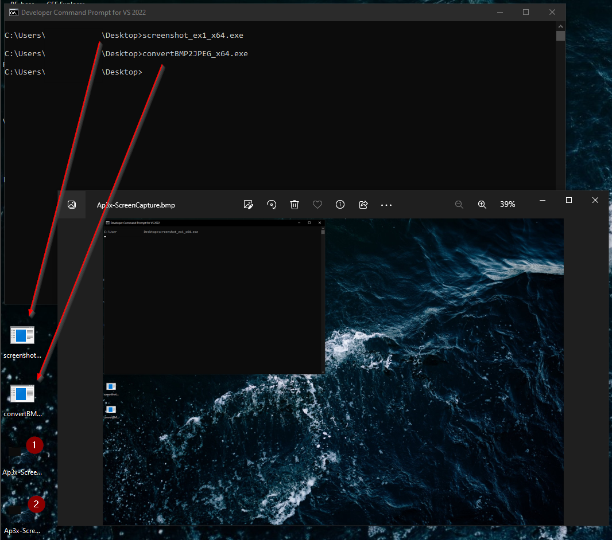
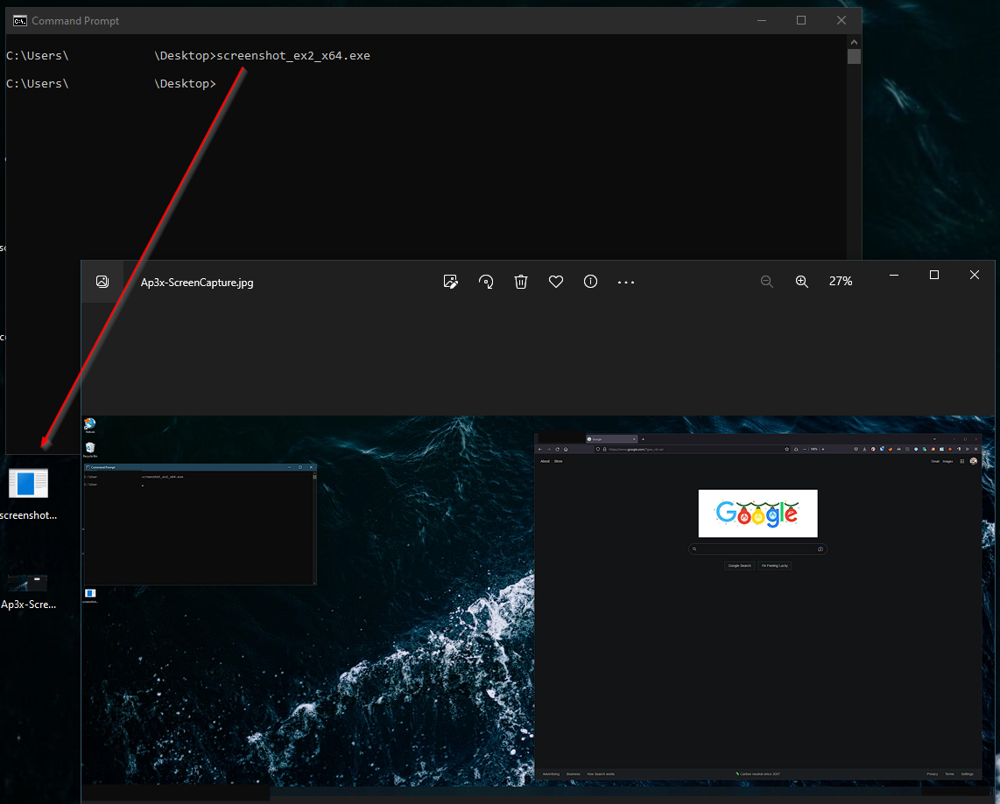

# WinAPI-Screenshot

This repo contains two examples that of how to capture a screen shot using Windows API. Between the two examples I recommend to use Example 2.

## Example 1
Contains two programs:

- SaveToBMP: Takes a screen capture of the users screen and saves it as a bitmap file.
- ConvertBMP2JPEG: Converts a BMP in the same location to a compressed JPEG file.

## Example 2 
This version is a bit more cleaned up compared to Example 1, but the file size is much larger using the default Makefile in each of the example folders.

